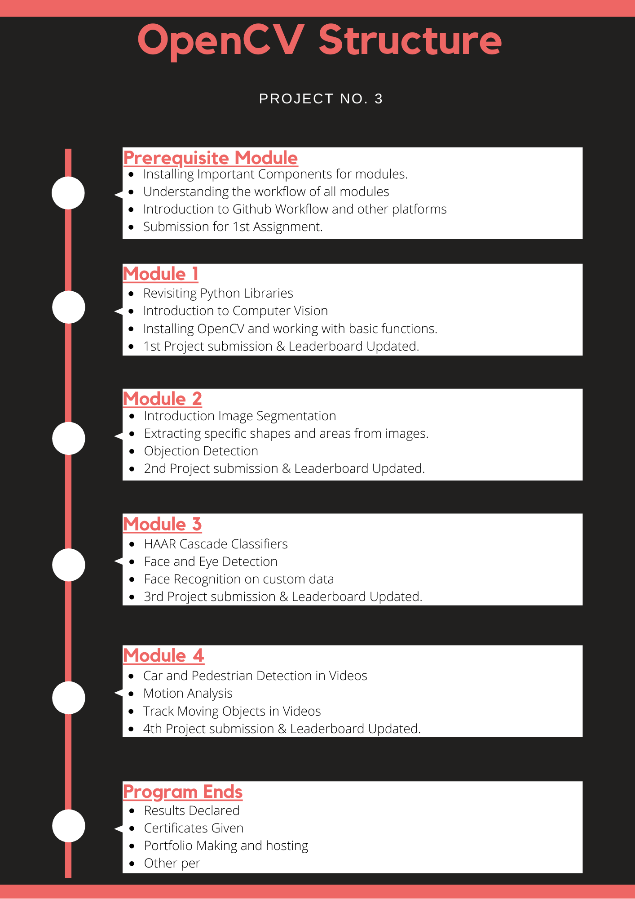

# Course Introduction

**Topics we will learn:** OpenCV, Computer vision: Object detection, Photo restoration, object tracking, and many more.

**Prerequisites:** Basic knowledge of python.

**Requirments:** Basic programming, High school level maths, A webcam, Python, OpenCV

>We will be building 7 projects during this course.

&nbsp;

&nbsp;

&nbsp;

&nbsp;

&nbsp;

&nbsp;

# Tasks for this module:

### [1. Introduction to markdown](Part1-markdown.md)

### [2. Introduction to Git](Part2-git.md)

### [3. Requirements]

* Basic Python knowledge
* Web cam
* Internet

### [4. Assignment](Part4-ass.md)
